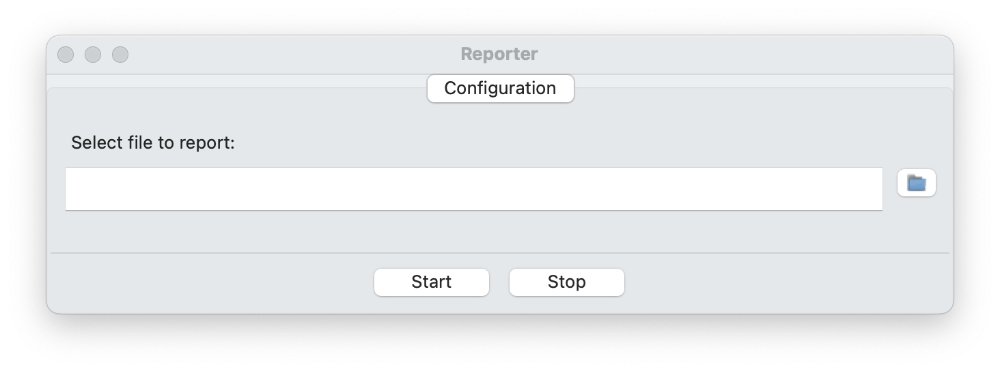

# The Runtime Reporter
This project contains an implementation of a Runtime Reporter (RR). The rationale behind this tool is that it captures the events reported by the software under test (SUT) along its execution and saves them in event log files (to be discussed below, in Section [Operation](#operation)), for performing runtime verification using the [Runtime Monitor](https://github.com/invap/rt-monitor/) (RM). This implementation of a reporter tool is conceived for working with programs which output the occurrence of events through appropriate instrumentation with the help of a reporter API (for example, the [C reporter API](https://github.com/invap/c-reporter-api/)).

## Instalation


### Requirements
- Python 3.12+

## Operation
The RR provides the basic functionality; once the SUT is chossen, the former runs the latter within a thread and captures its output pipe for pocessing the events and writing them in the corresponding event log files. The main log file is named `?_log.csv`, where `?` is the name of the SUT; for monitoring purposes this log file must be declared with the reference name "main" in the [event logs map file](https://github.com/invap/rt-monitor/blob/main/README.md#event-logs-map-file "Event logs map file") required by the [RM](https://github.com/invap/rt-monitor "Runtime Monitor") to execute the verification. The event log files produced by the self-loggable components receive their name from the name declared in the self-loggable component log initialization event, suffixed with `_log.csv`.

The SUT is assume to be instrumented for ouputing a stream of predefined event types packed in appropriate package types. Event types are defined in agreement between the RR and the reporter API; in our case, the definition can be seen in [Line 49](https://github.com/invap/c-reporter-api/blob/main/include/data_channel_defs.h#L49 "Event types") of file [`data_channel_defs.h`](https://github.com/invap/c-reporter-api/blob/main/include/data_channel_defs.h) as a C enumerated type:
```c
//classification of the different types of events
typedef enum {timed_event, state_event, process_event, component_event, self_loggable_component_log_init_event, self_loggable_component_event} eventType;
```
which are naturally recognized as integers by the code fragment from [Line 78](https://github.com/invap/rt-reporter/blob/main/reporter_communication_channel.py#L78) to [Line 107](https://github.com/invap/rt-reporter/blob/main/reporter_communication_channel.py#L107) where appropriate action is taken for each type of event, according to the association {(0, `timed_event`), (1, `state_event`), (2, `process_event`), (3, `component_event`), (4, `self_loggable_component_log_init_event`), (5, `self_loggable_component_event`)}. 
Each event type arrives packed in a package type corresponding to the event it contains, as they are defined in the code fragment from [Line 18](https://github.com/invap/rt-monitor-example-app/blob/main/buggy%20app/main.c#L18) to [Line 46](https://github.com/invap/rt-monitor-example-app/blob/main/buggy%20app/main.c#L46) of in the file [`data_channel_defs.c`](https://github.com/invap/c-reporter-api/blob/main/include/data_channel_defs.h).
All package types come inside a reporter package (see code fragment from [Line 51](https://github.com/invap/rt-monitor-example-app/blob/main/buggy%20app/main.c#L51) to [Line 62](https://github.com/invap/rt-monitor-example-app/blob/main/buggy%20app/main.c#L62) of file [`data_channel_defs.c`](https://github.com/invap/c-reporter-api/blob/main/include/data_channel_defs.h)) labeled with the event type they contain and time-stamped.
Whenever a reporter package is unpacked by the reporter (see code fragment from [Line 73](https://github.com/invap/rt-reporter/blob/main/src/reporter_communication_channel.py#L73) to [Line 77](https://github.com/invap/rt-reporter/blob/main/src/reporter_communication_channel.py#L77) of file [`reporter_communication_channel.py`](https://github.com/invap/rt-reporter/blob/main/src/reporter_communication_channel.py)) we obtain: 1) a `[timestamp]`, 2) an event type (interpreted as an integer), and 3) an `[event]`. According to the event type obtained after unpacking the reporter package, appropriate logging actions are taken:
- case 0: records the line "[timestamp],timed_event,[event]" in file corresponding to the main event log file. `[event]` provide details of the timed event reported and has the shape `[clock action],[clock variable]` where `[clock action]` is in the set {clock_start, clock_pause, clock_resume, clock_reset} and `[clock variable]` is the name of a free clock variable occurring in any property of the structured sequential process (see Section [Syntax for writing properties](https://github.com/invap/rt-monitor/blob/main/README.md#syntax-for-writing-properties "Syntax for writing properties") for details on the language for writing properties of structured sequential processes),
- case 1: records the line "[timestamp],state_event,[event]" in file corresponding to the main event log file. `[event]` provide details of the state event reported and has the shape `variable_value_assigned,[variable name],[value]` where `[variable name]` is the name of a free state variable occurring in any property of the structured sequential process (see Section [Syntax for writing properties](https://github.com/invap/rt-monitor/blob/main/README.md#syntax-for-writing-properties "Syntax for writing properties") for details on the language for writing properties of structured sequential processes),
- case 2: records the line "[timestamp],process_event,[event]" in file corresponding to the main event log file. `[event]` provide details of the process event reported and has the shape `task_started,[name]`, `task_finished,[name]` or `checkpoint_reached,[name]`, where `[name]` is a unique identifier corresponding to a task o checkpoint, respectively, in the structured sequential process (see Section [Structured Sequential Process](https://github.com/invap/rt-monitor/blob/main/README.md#structured-sequential-process "Structured Sequential Process") for details on the language for declaring structured sequential processes),
- case 3: records the line "[timestamp],component_event,[event]" in file corresponding to the main event log file. `[event]` provide details of the component event reported and has the shape `[component name],[function name],[parameter list],[result]`, where `[component name]` is a unique identifier corresponding to a component declared in the specification of the analysis framework (see Section [Specification language for describing the analysis framework](https://github.com/invap/rt-monitor/blob/main/README.md#specification-language-for-describing-the-analysis-framework "Specification language for describing the analysis framework") for details on the language for specifying the analysis framework), `[function name]` is the name of a function implemented by the component, `[parameter list]` is the list of parameters required by the function `[function name]`, separated by commas, and `[result]` is the value returned by the invocation, provided that the function returns a value, see for example the code fragment from [Line 70](https://github.com/invap/rt-monitor-example-app/blob/main/buggy%20app/main.c#L70) to [Line 76](https://github.com/invap/rt-monitor-example-app/blob/main/buggy%20app/main.c#L76) of the function [`main`](https://github.com/invap/rt-monitor-example-app/blob/main/buggy%20app/main.c#L17), in the file [`main.c`](https://github.com/invap/rt-monitor-example-app/blob/main/buggy%20app/main.c), where the invocation of function `sample` is followed by a code fragment reporting a component event:  
```c
value = sample ();
// [ INSTRUMENTACION: Component event. ]
pause(&reporting_clk);
sprintf(str, "adc,sample,%d",value);
report(component_event,str);
resume(&reporting_clk);
//
```
- case 4: in this case, no line is written to any event log because the event reported is the initialization of the event log file of a self-loggable component; thus, `[event]` only contains the name of the self-loggable component so the reporter can open a file named `[event]_log.csv` for writing,
- case 5: in this case `[event]` has the shape `[component name],[component event]', thus the reporter writes the line "[timestamp],[component event]" in the event log file corresponding to `[component name]`, and
- in any other case: records the line "[timestamp],invalid,[event]" in file corresponding to the main event log file.


## GUI interface
The graphical user interface for the RR is very simple, it is launched by typing `python rt-reporter-gui` which will open de main window of the GUI of the RR, shown in [Figure 1](#main-window).

<figure id="main-window" style="text-align: center;">
  
  <figcaption style="font-style: italic;"><b>Figure 1</b>: The main window of the GUI of the RR.
  </figcaption>
</figure>

After clicking in the folder icon on the right of the text box, the file selection window will open (shown in [Figure 2](#file-selection-window)) and will allow to chose the executable file whose events will be recorded.

<figure id="file-selection-window" style="text-align: center;">
  
  <figcaption style="font-style: italic;"><b>Figure 2</b>: File selection window of the GUI of the RR.
  </figcaption>
</figure>

Then, clicking on the `Start` button at the bottom of [Figure 2](#file_selection_window) will run the SUT producing the corresponding event log files in the same location where the SUT is.

The `Stop` button at the bottom of [Figure 2](#file_selection_window) stops the execution of the SUT and closes the event log files.

Closing the window exits the GUI of the RR. 


## Command line interface
The command line interface for the RR is very simple, it is invoked by typing `python rt-reporter-sh [SUT full path]` and it will run the SUT producing the corresponding event log files in the same location where the SUT is, according to the indicated in `[SUT full path]`.

The interface keeps itself listening to the keyboard; pressing the letter `s` stops the execution of the SUT, closes the event log files and exits the command line interface of the RR.

An alternative implementation for Windows-based systems can be developed using `msvcrt`.

### Errors
This section shows a list of errors that can be yielded by the command line interface:
- Error -1, "Erroneous number of arguments.": the command line interface expects exactly one parameter that is taken as the SUT to be reported; if it is passed zero or more than 1 parameter this error is yielded.
- Error -2: "File not found.": the command line interface expects the only parameter passed to be a file containing the SUT to be reported; if it is not present, this error is yielded.

In Mac OS the execution of the RR migth output the message "This process is not trusted! Input event monitoring will not be possible until it is added to accessibility clients.". This happens when an application attempts to monitor keyboard or mouse input without having the necessary permissions because Mac OS restricts access to certain types of input monitoring for security and privacy reasons. To solve it you need to grant accessibility permissions to the application running the program (e.g., Terminal, iTerm2, or a Python IDE). Here’s how:
1. Open System Preferences:
	- Go to **Apple menu** --> **System Preferences** --> **Security & Privacy**.
2. Go to Accessibility Settings:
	- In the **Privacy** tab, select **Accessibility** from the list on the left.
3. Add Your Application:
	- If you are running the RR from **Terminal**, **iTerm2**, or a specific **IDE** (like PyCharm or VS Code), you will need to add that application to the list of allowed applications.
	- Click the **lock icon** at the bottom left and enter your password to make changes.
	- Then, click the `+` button, navigate to the application (e.g., Terminal or Python IDE), and add it to the list.
4. Restart the Application:
	- After adding it to the Accessibility list, restart the application to apply the new permissions.
Once you’ve done this, the message should go away, and pynput should be able to detect keyboard and mouse events properly.


## License

Copyright (c) 2024 INVAP

Copyright (c) 2024 Fundacion Sadosky

This software is licensed under the Affero General Public License (AGPL) v3. If you use this software in a non-profit context, you can use the AGPL v3 license.

If you want to include this software in a paid product or service, you must negotiate a commercial license with us.

### Benefits of dual licensing:

It allows organizations to use the software for free for non-commercial purposes.

It provides a commercial option for organizations that want to include the software in a paid product or service.

It ensures that the software remains open source and available to everyone.

### Differences between the licenses:

The AGPL v3 license requires that any modifications or derivative works be released under the same license.

The commercial license does not require that modifications or derivative works be released under the same license, but it may include additional terms and conditions.

### How to access and use the licenses:

The AGPL v3 license is available for free on our website.

The commercial license can be obtained by contacting us at info@fundacionsadosky.org.ar

### How to contribute to the free open source version:

Contributions to the free version can be submitted through GitHub.
You shall sign a DCO (Developer Certificate of Origin) for each submission from all the members of your organization. The OCD will be an option during submission at GitHub.

### How to purchase the proprietary version:

The proprietary version can be purchased by contacting us at info@fundacionsadosky.org.ar


