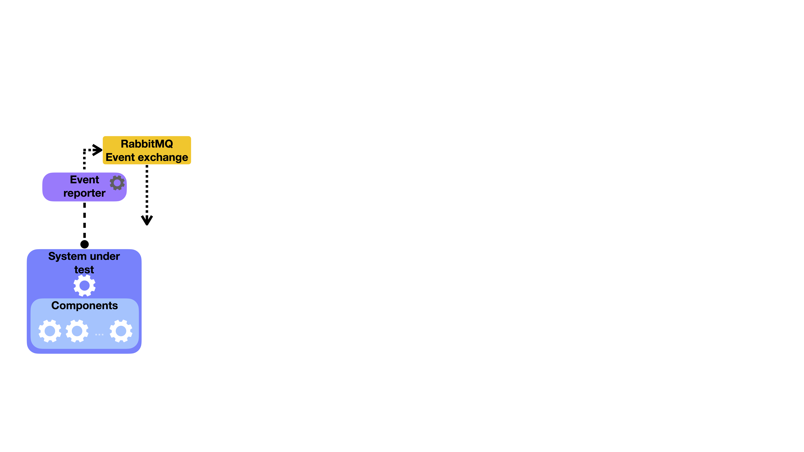

# The Runtime Reporter
This project contains an implementation of a Runtime Reporter (RR) for the RT-Constellation. The rationale behind this tool is that it captures the events reported by the *System Under Test* (SUT) along its execution and sends them across the RabbitMQ events exchange found in the RabbitMQ server configuration file. This implementation of a event reporter is conceived for working with programs which output the occurrence of events through appropriate instrumentation with the help of a reporter API (for example, the [C reporter API](https://github.com/invap/c-reporter-api/) of the [Rust reporter API](https://github.com/invap/rust-reporter-api/)).

## Structure the project
The RR project is organized as follows:
```graphql
rt-reporter/
├── rt_reporter/                            # Package folder
│   ├── communication_channel_conf.py       # Information for configuring the communication channel
│   ├── config.py                           # Definition of the reporter configuration class
│   ├── logging_configuration.py            # Definition of the logging configuration class and functions
│   ├── rabbitmq_server_connections.py      # Implements the code for the rt-reporter to attach to the RabbitMQ communication channels required to execute
│   ├── reporter.py                         # Main module for lauching the SUT and building the event logs
│   ├── rt_reporter_sh.py                   # Entry point of the command line interface of the RR
│   └── utility.py                          # Implements functions for checking the validity of the input files 
├── LICENSE                                 # Licence of the project 
├── Dockerfile                              # File containing the configuration for running the RR in a docker container 
├── pyproject.toml                          # Configuration file (optional, recommended)
└── README.md                               # Read me file of the project
```


## Installation
In this section we will review relevant aspects of how to setup this project, both for developing new features for the RR, and for using it in the runtime verification of other software artifacts.

### Base Python installation

1. Python v.3.12+ (https://www.python.org/)
2. PIP v.24.3.1+ (https://pip.pypa.io/en/stable/installation/)
3. Setup tools v.75.3.0+ / Poetry v.2.1.1+ (https://python-poetry.org)


### Setting up the project using Poetry
This section provide instructions for setting up the project using [Poetry](https://python-poetry.org)
1. **Install Poetry:** find instructions for your system [here](https://python-poetry.org) 
2. **Add [`pyproject.toml`](https://github.com/invap/rt-reporter/blob/main/pyproject.toml):** the content of the `pyproject.toml` file needed for setting up the project using poetry is shown below.
```toml
[project]
name = "rt-reporter"
version = "2.1.1"
description = "This project contains an implementation of a Runtime Reporter (RR) for the RT-Constellation. The rationale behind this tool is that it captures the events reported by the Software Under Test (SUT) along its execution and sends them across the RabbitMQ events exchange found in the RabbitMQ server configuration file. This implementation of a event reporter is conceived for working with programs which output the occurrence of events through appropriate instrumentation with the help of a reporter API (for example, the [C reporter API](https://github.com/invap/c-reporter-api/) of the [Rust reporter API](https://github.com/invap/rust-reporter-api/))."
authors = [
  {name = "Carlos Gustavo Lopez Pombo", email = "clpombo@gmail.com"}
]
license = "GNU AFFERO GENERAL PUBLIC LICENSE Version 3, 19 November 2007"
readme = "README.md"
repository = "https://github.com/invap/rt-reporter"
requires-python = ">=3.12,<3.14"
packages = [
    { include = "rt_reporter"},
]
dependencies = [
    "pika (~=1.3.2)",
    "rt-rabbitmq-wrapper @ git+https://github.com/invap/rt-rabbitmq-wrapper.git@v2.0.1"
]

[build-system]
requires = ["poetry-core"]
build-backend = "poetry.core.masonry.api"

[dependency-groups]
dev = [
    "pytomlcleaner (>=1.0.0,<2.0.0)"
]
```
3. **Install the project:** To install the Python project using Poetry, navigate to the directory where the project is and run:
   ```bash	
   poetry install
   ```
4. **Activate the virtual environment**: To activate the virtual environment created by the previous command run:
   ```bash
   poetry env use [your_python_command]
   poetry env activate
   ```
this will ensure you are using the right Python virtual machine and then, activate the virtual environment.


### Using the project with docker
1. **Build the image:**
    ```bash
    docker build . -t rt-reporter-env
    ```
2. **Run the container:**
	```bash
	docker run -it -v$PWD:/home/workspace rt-reporter-env
	```
3. **Do something with the RR...**


### Linting Python code (with Black)
A linter in Python is a tool that analyzes your code for potential errors, code quality issues, and stylistic inconsistencies. Linters help enforce a consistent code style and identify common programming mistakes, which can improve the readability and maintainability of your code. They’re especially useful in team environments to maintain coding standards.

Though primarily an auto-formatter, `Black` enforces a consistent code style and handles many linting issues by reformatting your code directly.

1. **Activate the virtual environment in your project directory:**
2. **Run linter (black):**
	- For correcting the code:
	```bash
	black .
	```
	- For checking but not correcting the code:
	```bash
	black . --check
	```


### Testing the implementation
Tu run the unit tests of the project use the command `python -m unittest discover -s . -t .`.

When executed, it performs Python unit tests with the `unittest` module, utilizing the `discover` feature to automatically find and execute test files.
- `python -m unittest`:
Runs the `unittest` module as a script. This is a built-in Python module used for testing. When called with `-m`, it allows you to execute tests directly from the command line.
- `discover`:
Tells `unittest` to search for test files automatically. This is useful when you have many test files, as it eliminates the need to specify each test file manually. By default, `unittest` discover will look for files that start with "test" (e.g., `test_example.py`).
- `-s .`:
The `-s` option specifies the start directory for test discovery.
Here, `.` means the current directory, so `unittest` will start looking for tests in the current directory and its subdirectories.
- `-t .`:
The `-t` option sets the top-level directory of the project.
Here, `.` also indicates the current directory. This is mainly useful when the start directory (`-s`) is different from the project's root. For simple projects, the start directory and top-level directory are often the same.

**In summary, this command tells Python’s `unittest` module to:**
Look in the current directory (`-s .`) for any test files that match the naming pattern `test*.py`.
Run all the tests it finds, starting from the current directory (`-t .`) and treating it as the top-level directory.

### Build the application as a library
To build a package from the Python project follow these steps:
Now that your configuration files are set, you can build the package using poetry running the build command in the root directory of the project:
```bash
poetry build
```
This will create two files in the [dist](https://github.com/invap/rt-reporter/tree/main/dist/) directory containing:
- A source distribution file named `rt_reporter-[version].tar.gz`
- A wheel distribution file named `rt_reporter-[version]-py3-none-any.whl`


### Distribution Options

#### Option A: PyPI (Public)

1. Configure PyPI repository (if not using TestPyPI):
```bash
poetry config pypi-token.pypi your-api-token
```
2. Publish to PyPI:
```bash
poetry publish
```

#### Option B: Test PyPI

```bash
# Configure TestPyPI
poetry config repositories.testpypi https://test.pypi.org/legacy/

# Publish to TestPyPI
poetry publish -r testpypi --build
```

#### Option C: Private/Internal Distribution

Configure private repository:
```bash
poetry config repositories.my-private https://your-private-pypi.com/simple/
poetry config http-basic.my-private username password
```
Publish to private repo:
```bash
poetry publish -r my-private --build
```

#### Option D: Direct Distribution

Share the wheel file directly:

```bash
# The wheel file is in dist/
ls dist/
# Share rt_reporter-[version]-py3-none-any.whl
```

### Version Management

Update version before building:

```bash
# Patch release (0.1.0 -> 0.1.1)
poetry version patch

# Minor release (0.1.0 -> 0.2.0)
poetry version minor

# Major release (0.1.0 -> 1.0.0)
poetry version major

# Specific version
poetry version 1.2.3
```

### Verification

Verify your package:

```bash
# Check the wheel contents
poetry run python -c "import rt_reporter; print(rt_reporter.__version__)"

# Or install and test
pip install dist/rt_reporter-*.whl
python -c "import rt_reporter"
```


## Relevant information about the implementation
[Figure 1](#rt-reporter-architecture) shows a high level view of the architecture of the RR. In it, we highlight the most relevant components and how they interact with each other and with the other agents of the RT-Constellation, through the RabbitMQ events exchange found in the RabbitMQ server configuration file.

<figure id="rt-reporter-architecture" style="text-align: center;">
  
  <figcaption style="font-style: italic;"><b>Figure 1</b>: The Runtime Reporter architecture.
  </figcaption>
</figure>

The RR provides the functionality of running the SUT within a thread, capturing its output pipe throgut which it receives the events reported along the execution, and sending them throught the RabbitMQ events exchange found in the RabbitMQ server configuration file.

The SUT is assumed to be instrumented for ouputing a stream of predefined event types. Event types are defined as part of the reporting API; for example, in the case of the [C reporter API](https://github.com/invap/c-reporter-api/), the definition can be found in [Line 16](https://github.com/invap/c-reporter-api/blob/main/include/data_channel_defs.h#L16 "Event types") of file [`data_channel_defs.h`](https://github.com/invap/c-reporter-api/blob/main/include/data_channel_defs.h) as a C enumerated type:
```c
//classification of the different types of events
typedef enum {
	timed_event, 
	state_event, 
	process_event, 
	component_event, 
	end_of_report_event
} eventType;
```
which are naturally recognized as integers by the code fragment from [Line 78](https://github.com/invap/rt-reporter/blob/main/reporter_communication_channel.py#L78) to [Line 107](https://github.com/invap/rt-reporter/blob/main/reporter_communication_channel.py#L107) where appropriate action is taken for each type of event, according to the association {(0, `timed_event`), (1, `state_event`), (2, `process_event`), (3, `component_event`), (4, `end_of_report_event`)}. 
Each event arrives packed in a reporter package (see code fragment from [Line 17](https://github.com/invap/c-reporter-api/blob/main/include/data_channel_defs.h#L17) to [Line 21](https://github.com/invap/c-reporter-api/blob/main/include/data_channel_defs.h#L21) of file [`data_channel_defs.c`](https://github.com/invap/c-reporter-api/blob/main/include/data_channel_defs.h)) labeled with the event type they contain and timestamped.
Whenever a reporter package is unpacked by the reporter (see code fragment from [Line 74](https://github.com/invap/rt-reporter/blob/main/rt_reporter/reporter.py#L74) to [Line 78](https://github.com/invap/rt-reporter/blob/main/rt_reporter/reporter.py#L78) of file [`reporter.py`](https://github.com/invap/rt-reporter/blob/main/rt_reporter/reporter.py)) we obtain: 1) a `[timestamp]`, 2) an event type (interpreted as an integer), and 3) an `[event]`. According to the event type obtained after unpacking the reporter package, appropriate logging actions are taken:
- case 0: records the line "[timestamp],timed_event,[event]" in file corresponding to the main event report file. `[event]` provide details of the timed event reported and has the shape `[clock action],[clock variable]` where `[clock action]` is in the set {clock_start, clock_pause, clock_resume, clock_reset} and `[clock variable]` is the name of a free clock variable occurring in any property of the structured sequential process (see Section [Syntax for writing properties](https://github.com/invap/rt-monitor/blob/main/README.md#syntax-for-writing-properties "Syntax for writing properties") for details on the language for writing properties of structured sequential processes),
- case 1: records the line "[timestamp],state_event,[event]" in file corresponding to the main event report file. `[event]` provide details of the state event reported and has the shape `variable_value_assigned,[variable name],[value]` where `[variable name]` is the name of a free state variable occurring in any property of the structured sequential process (see Section [Syntax for writing properties](https://github.com/invap/rt-monitor/blob/main/README.md#syntax-for-writing-properties "Syntax for writing properties") for details on the language for writing properties of structured sequential processes),
- case 2: records the line "[timestamp],process_event,[event]" in file corresponding to the main event report file. `[event]` provide details of the process event reported and has the shape `task_started,[name]`, `task_finished,[name]` or `checkpoint_reached,[name]`, where `[name]` is a unique identifier corresponding to a task o checkpoint, respectively, in the structured sequential process (see Section [Structured Sequential Process](https://github.com/invap/rt-monitor/blob/main/README.md#structured-sequential-process "Structured Sequential Process") for details on the language for declaring structured sequential processes),
- case 3: records the line "[timestamp],component_event,[event]" in file corresponding to the main event report file. `[event]` provide details of the component event reported and has the shape `[component name],[function name],[parameter list]`, where `[component name]` is a unique identifier corresponding to a component declared in the specification of the analysis framework (see Section [Specification language for describing the analysis framework](https://github.com/invap/rt-monitor/blob/main/README.md#specification-language-for-describing-the-analysis-framework "Specification language for describing the analysis framework") for details on the language for specifying the analysis framework), `[function name]` is the name of a function implemented by the component, and `[parameter list]` is the list of parameters required by the function `[function name]`, separated by commas, see for example the code fragment from [Line 70](https://github.com/invap/rt-monitor-example-app/blob/main/buggy%20app/main.c#L70) to [Line 76](https://github.com/invap/rt-monitor-example-app/blob/main/buggy%20app/main.c#L76) of the function [`main`](https://github.com/invap/rt-monitor-example-app/blob/main/buggy%20app/main.c#L17), in the file [`main.c`](https://github.com/invap/rt-monitor-example-app/blob/main/buggy%20app/main.c), where the invocation of function `sample` is followed by a code fragment reporting a component event:
```c
value = sample ();
// [ INSTRUMENTACION: Component event. ]
pause(&reporting_clk);
sprintf(str, "adc,sample");
report(component_event,str);
resume(&reporting_clk);
//
```
- case 4: in this case, no line is written to any event log because the event reported is the initialization of the event log file of a self-loggable component; thus, `[event]` only contains the name of the self-loggable component so the reporter can open a file named `[event]_log.csv` for writing,
- case 5: in this case `[event]` has the shape `[component name],[component event]', thus the reporter writes the line "[timestamp],[component event]" in the event log file corresponding to `[component name]`, and
- case 6: this event type correspond to an `end_of_report_event` event and no further information is required:
- in any other case: records the line "[timestamp],invalid,[event]" in file corresponding to the main event log file.

Other reporter APIs, like the [Rust reporter API](https://github.com/invap/rust_reporter-api) provide analogous implementations.


## Usage
The command line interface for the RR is very simple, see the help output below:
```txt
> python -m rt_reporter.rt_reporter_sh --help
usage: The Runtime Reporter [-h] [--rabbitmq_config_file RABBITMQ_CONFIG_FILE]
                            [--log_level {debug,info,warnings,errors,critical}]
                            [--log_file LOG_FILE] [--timeout TIMEOUT]
                            sut

Reports events obtained from an execution of a SUT by publishing them to a
RabbitMQ server.

positional arguments:
  sut                   Path to the executable binary.

options:
  -h, --help            show this help message and exit
  --rabbitmq_config_file RABBITMQ_CONFIG_FILE
                        Path to the TOML file containing the RabbitMQ server
                        configuration.
  --log_level {debug,info,warnings,errors,critical}
                        Log verbose level.
  --log_file LOG_FILE   Path to log file.
  --timeout TIMEOUT     Timeout for the event acquisition process in seconds
                        (0 = no timeout).

Example: python -m rt_reporter.rt_reporter_sh /path/to/sut
--rabbitmq_config_file=./rabbitmq_config.toml --log_file=output.log
--log_level=event --timeout=120
```


### Errors
This section shows a list of errors that can be yielded by the command line interface:
- Error -1: "Input file error" indicates that there was an error while trying to open the SUT file
- Error -2: "RabbitMQ configuration error" indicates that there was an error during the configuration of the communication infrastructure
- Error -3: "Reporter error" indicates that there was an error during the reporting process
- Error -4: "Unexpected error"

In Mac OS the execution of the RR migth output the message "This process is not trusted! Input event monitoring will not be possible until it is added to accessibility clients.". This happens when an application attempts to monitor keyboard or mouse input without having the necessary permissions because Mac OS restricts access to certain types of input monitoring for security and privacy reasons. To solve it you need to grant accessibility permissions to the application running the program (e.g., Terminal, iTerm2, or a Python IDE). Here’s how:
1. Open System Preferences:
	- Go to **Apple menu** --> **System Preferences** --> **Security & Privacy**.
2. Go to Accessibility Settings:
	- In the **Privacy** tab, select **Accessibility** from the list on the left.
3. Add Your Application:
	- If you are running the RR from **Terminal**, **iTerm2**, or a specific **IDE** (like PyCharm or VS Code), you will need to add that application to the list of allowed applications.
	- Click the **lock icon** at the bottom left and enter your password to make changes.
	- Then, click the `+` button, navigate to the application (e.g., Terminal or Python IDE), and add it to the list.
4. Restart the Application:
	- After adding it to the Accessibility list, restart the application to apply the new permissions.
Once you’ve done this, the message should go away, and pynput should be able to detect keyboard and mouse events properly.


## License

Copyright (c) 2024 INVAP

Copyright (c) 2024 Fundacion Sadosky

This software is licensed under the Affero General Public License (AGPL) v3. If you use this software in a non-profit context, you can use the AGPL v3 license.

If you want to include this software in a paid product or service, you must negotiate a commercial license with us.

### Benefits of dual licensing:

It allows organizations to use the software for free for non-commercial purposes.

It provides a commercial option for organizations that want to include the software in a paid product or service.

It ensures that the software remains open source and available to everyone.

### Differences between the licenses:

The AGPL v3 license requires that any modifications or derivative works be released under the same license.

The commercial license does not require that modifications or derivative works be released under the same license, but it may include additional terms and conditions.

### How to access and use the licenses:

The AGPL v3 license is available for free on our website.

The commercial license can be obtained by contacting us at info@fundacionsadosky.org.ar

### How to contribute to the free open source version:

Contributions to the free version can be submitted through GitHub.
You shall sign a DCO (Developer Certificate of Origin) for each submission from all the members of your organization. The OCD will be an option during submission at GitHub.

### How to purchase the proprietary version:

The proprietary version can be purchased by contacting us at info@fundacionsadosky.org.ar


